# SkillRoute

SkillRoute is a web platform for students and companies that helps match candidate skills with job requirements. Students build a profile, add skills, verify them via GitHub, and get development roadmaps for selected vacancies. Companies post vacancies, browse matching students, manage applications, and communicate with candidates via chat.

The project is a monolithic Spring Boot application: the server handles web pages, AJAX API, registration, security, business logic, PostgreSQL/Redis integration, email delivery, and background GitHub skill synchronization. The UI is built with FreeMarker templates, CSS, and small JavaScript modules for forms, chat, and async actions.

## Features

- Student and company registration with email confirmation.
- Login via Spring Security with roles `STUDENT`, `COMPANY`, `ADMIN`.
- Password recovery and change via email tokens stored in Redis.
- Personal dashboards for students and companies.
- Student profile: first name, last name, specialization, GitHub, bio.
- Company profile: name, description, website, and admin approval.
- Skill and specialization catalog with seed data on first run.
- Student skills with proficiency levels from 1 to 5.
- GitHub skill synchronization: analysis of repositories, languages, topics, descriptions, and code search.
- Background GitHub sync queue with rate limit handling and retries.
- Company vacancies with specialization, salary, schedule, status, and required skills.
- Student vacancy catalog: recommendations, popular vacancies, filtering, and tracked vacancies.
- Student applications with statuses `SUBMITTED`, `REVIEWING`, `INTERVIEW`, `REJECTED`, `ACCEPTED`.
- Vacancy roadmap: match percentage calculation, missing skills, gap depth, and learning resources.
- Skill learning resources managed by companies.
- Chats between companies and students per vacancy.
- OpenAPI description of the AJAX API and Swagger UI.
- Docker Compose environment with the application, PostgreSQL, and Redis.

## Architecture

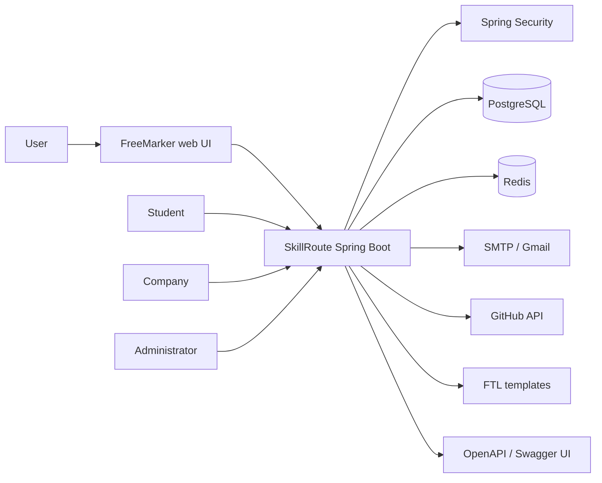

### Project Layers

| Path | Purpose |
| --- | --- |
| `src/main/java/com/skillroute/controller` | MVC pages and REST controllers for the AJAX API |
| `src/main/java/com/skillroute/service` | Business logic for registration, profiles, vacancies, roadmap, chats, and GitHub sync |
| `src/main/java/com/skillroute/repository` | Spring Data JPA repositories and custom queries |
| `src/main/java/com/skillroute/model` | JPA entities and enum statuses |
| `src/main/java/com/skillroute/dto` | Request and response DTOs for pages and API |
| `src/main/java/com/skillroute/mapper` | Entity-to-DTO mapping |
| `src/main/resources/templates` | FreeMarker page templates |
| `src/main/resources/static` | CSS, JavaScript, and OpenAPI YAML |
| `src/main/resources/db` | Liquibase changelog and seed data |
| `http` | HTTP requests for manual testing of pages and the AJAX API |

### Core Entities

| Entity | Purpose |
| --- | --- |
| `account` | Account, email, password, role, confirmation flag |
| `student_profile` | Student profile, GitHub URL, specialization, bio |
| `company_profile` | Company profile and admin approval flag |
| `specialization` | Direction and language: backend, frontend, data, devops, and others |
| `skill`, `student_skill` | Skill catalog and student skills with proficiency level |
| `skill_dictionary` | Rules for finding skills in GitHub |
| `vacancy`, `vacancy_profile`, `vacancy_skill` | Vacancy, vacancy profile, and required skills |
| `student_vacancy` | Student application or tracked vacancy |
| `resource` | Learning resources for skills |
| `chat`, `message` | Dialogs and messages |
| `github_sync_job` | Background GitHub sync queue |

## Stack

- Java 23
- Spring Boot 3.4.3
- Gradle Kotlin DSL
- Spring MVC + FreeMarker
- Spring Security
- Spring Data JPA
- PostgreSQL 17
- Liquibase
- Redis 7
- Spring Mail / SMTP
- OkHttp
- Springdoc OpenAPI + Swagger UI
- OpenAPI Generator 7.10.0
- Lombok
- Docker and Docker Compose
- JUnit 5, Spring Security Test, JaCoCo

## Quick Start

### Requirements

- JDK 23
- Docker and Docker Compose
- GitHub token for repository analysis
- SMTP account for sending emails. Gmail usually requires an app password.

### Running with Docker Compose

1. Create a local `.env` from the template:

```powershell
Copy-Item .env.example .env
```

On Linux/macOS:

```bash
cp .env.example .env
```

2. Fill in `.env`:

```dotenv
DB_USER=skillroute
DB_PASSWORD=change_me
DB_NAME=skillroute_db
APP_PORT=8080

MAIL_USER=example@gmail.com
MAIL_PASSWORD=change_me
MAIL_BASE_URL=http://localhost:8080

GITHUB_TOKEN=github_pat_change_me
```

3. Build and start the environment:

```powershell
docker compose up --build -d
```

4. Check containers:

```powershell
docker compose ps
```

5. Open the application:

```text
http://localhost:8080
```

Swagger UI:

```text
http://localhost:8080/swagger-ui.html
```

Stop the environment:

```powershell
docker compose down
```

Stop and remove PostgreSQL and Redis data:

```powershell
docker compose down -v
```

### Running Locally from IDE or Gradle

To run the application outside Docker, you need PostgreSQL on `localhost:5432` and Redis on `localhost:6379`. Environment variables can be set in the IDE run configuration or directly in PowerShell:

```powershell
$env:DB_USER="skillroute"
$env:DB_PASSWORD="change_me"
$env:DB_NAME="skillroute_db"
$env:MAIL_USER="example@gmail.com"
$env:MAIL_PASSWORD="change_me"
$env:MAIL_BASE_URL="http://localhost:8080"
$env:GITHUB_TOKEN="github_pat_change_me"
.\gradlew.bat bootRun
```

On Linux/macOS, use `export` and `./gradlew bootRun`.

On startup, Liquibase applies migrations from `src/main/resources/db/changelog`, and `DatabaseSeeder` populates the database with specializations, skills, and the GitHub dictionary from `src/main/resources/db/data/skills-seed.sql` if the dictionary is empty.

## Environment Variables

| Variable | Purpose |
| --- | --- |
| `DB_USER` | PostgreSQL user |
| `DB_PASSWORD` | PostgreSQL password |
| `DB_NAME` | Database name |
| `APP_PORT` | External application port in Docker Compose, default `8080` |
| `MAIL_USER` | SMTP sender login |
| `MAIL_PASSWORD` | SMTP password or app password |
| `MAIL_BASE_URL` | Base URL for email confirmation and password reset links |
| `GITHUB_TOKEN` | Token for GitHub REST API and code search |
| `SPRING_DATASOURCE_URL` | Optional JDBC URL override |
| `SPRING_DATA_REDIS_HOST` | Optional Redis host override |

## Ports

| Component | URL |
| --- | --- |
| SkillRoute | <http://localhost:8080> |
| Login | <http://localhost:8080/login> |
| Swagger UI | <http://localhost:8080/swagger-ui.html> |
| OpenAPI YAML | <http://localhost:8080/openapi/skillroute-api.yaml> |

In Docker Compose, PostgreSQL and Redis are accessible within the `skillroute_net` network. Only the application is exposed externally.

## User Scenarios

### Student

1. Registers at `/register` with the `STUDENT` role.
2. Confirms email via the link in the confirmation message.
3. Fills in their profile at `/student/profile/update`.
4. Adds skills at `/student/skills`.
5. Sets a GitHub URL and triggers skill synchronization.
6. Browses vacancies at `/student/vacancies`, filters the catalog, and applies.
7. Opens `/route`, selects a tracked vacancy, and gets a roadmap for missing skills.
8. Communicates with companies in `/student/chats`.

### Company

1. Registers at `/register` with the `COMPANY` role.
2. Confirms email and fills in the profile at `/company/profile/update`.
3. Waits for admin approval.
4. Creates vacancies at `/company/vacancies/create`.
5. Reviews candidates at `/company/vacancies/{id}/applicants`.
6. Starts a chat with a student and updates the application status.
7. Adds learning resources to skills via `/company/skills`.

### Administrator

The administrator sees companies awaiting approval on `/main` and approves them via `POST /main/companies/{id}/approve`. Registration via the form is only available for students and companies, so an admin account must be created separately if company moderation is needed.

## API and Contracts

The OpenAPI specification is located at `src/main/resources/static/openapi/skillroute-api.yaml`. Swagger UI is available at `/swagger-ui.html`.

### AJAX API

| Method | Endpoint | Description |
| --- | --- | --- |
| `POST` | `/register/check-field` | Validate registration form |
| `POST` | `/password/reset/check-field` | Validate new password form |
| `POST` | `/account/password/check-field` | Validate current user's password change |
| `GET` | `/student/skills/search?name=java` | Search student skills |
| `POST` | `/student/skills/github-sync` | Queue a GitHub synchronization |
| `GET` | `/student/skills/github-sync/status` | Get GitHub sync status |
| `GET` | `/chat/{id}/messages` | Get chat messages |
| `POST` | `/chat/{id}/send` | Send a message to a chat |

### Web Pages

| Section | Main Routes |
| --- | --- |
| Public pages | `/`, `/register`, `/login`, `/verification`, `/password/forgot`, `/password/reset` |
| Dashboard | `/main` |
| Student | `/student/profile`, `/student/skills`, `/student/vacancies`, `/route`, `/student/chats` |
| Company | `/company/profile`, `/company/vacancies`, `/company/students`, `/company/skills`, `/company/chats` |
| Chat | `/chat/{id}/messages`, `/chat/{id}/send` |
| API docs | `/swagger-ui.html`, `/openapi/skillroute-api.yaml` |

Ready-made HTTP requests for manual testing:

- `http/web-pages.http`
- `http/ajax-api.http`

## GitHub Skill Synchronization

Synchronization is triggered by the student from the skills section. The application extracts the username from the GitHub URL, collects signals from repositories via `https://api.github.com/users/{username}/repos`, and performs code search as needed using rules from `skill_dictionary`.

The queue is stored in the `github_sync_job` table. A worker runs on a schedule defined by `github.sync.worker-delay-millis`, transitions jobs to `RUNNING`, updates progress, and completes them with a status of `SUCCESS` or `FAILED`. If GitHub returns a rate limit response, the job is returned to `PENDING` with a `retry_after_at` timestamp.

## Tests and Quality

Run tests:

```powershell
.\gradlew.bat test
```

Check JaCoCo coverage:

```powershell
.\gradlew.bat jacocoTestCoverageVerification
```

Generate OpenAPI models:

```powershell
.\gradlew.bat openApiGenerate
```

Build jar:

```powershell
.\gradlew.bat bootJar
```

On Linux/macOS, replace `.\gradlew.bat` with `./gradlew`.

## Database Structure

Migrations are connected via `src/main/resources/db/master.xml`:

- `2026-04-21--01-create-profiles-tables.sql` — accounts, profiles, specializations.
- `2026-04-22--02-create-skill-tables.sql` — student skills.
- `2026-04-24--03-create-vacancies-tables.sql` — vacancies, requirements, and applications.
- `2026-04-25--04-create-resource-table.sql` — learning resources.
- `2026-05-03--05-create-chats-tables.sql` — chats and messages.
- `2026-05-07--06-create-skill-dictionary.sql` — GitHub signal dictionary.
- `2026-05-18--07-create-github-sync-job.sql` — GitHub sync queue.

## Screenshots

### Home Page
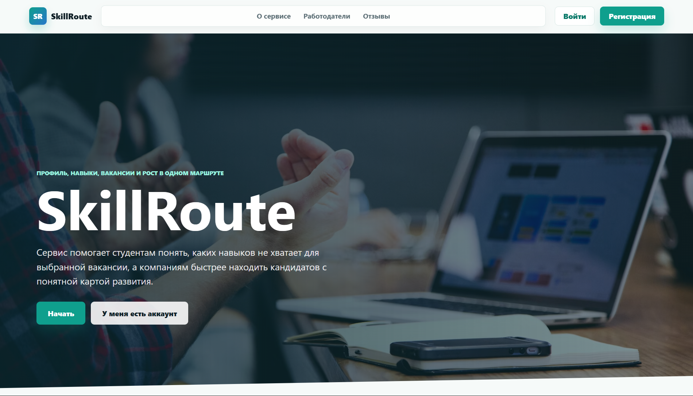

### Registration Form with Student or Company Role Selection
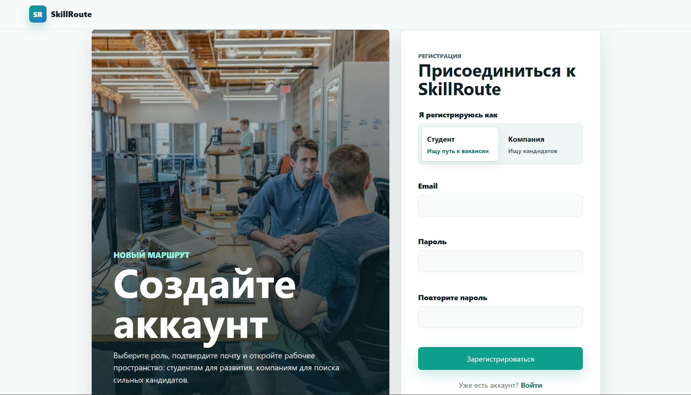

### Completed Student Profile
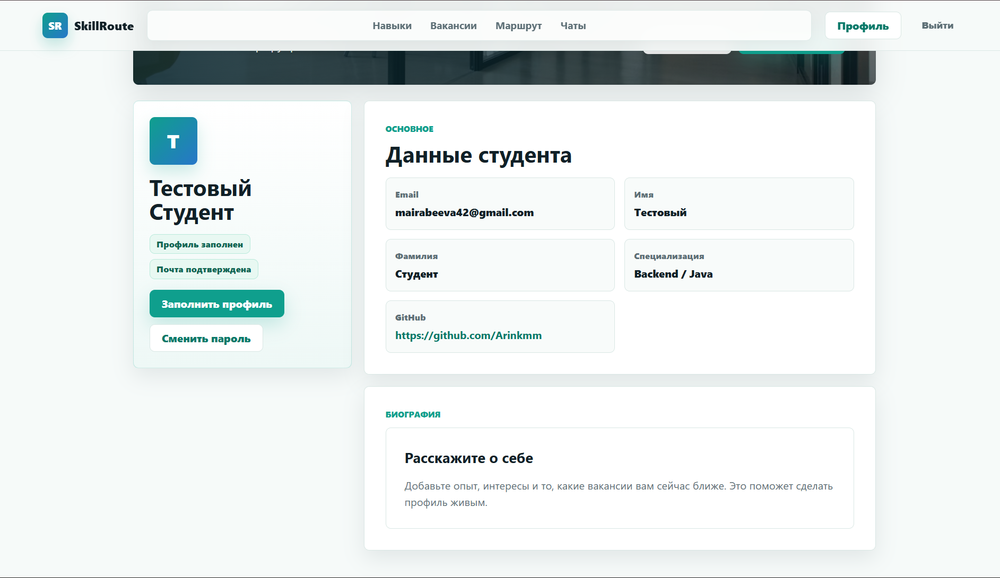

### Student Skills Section
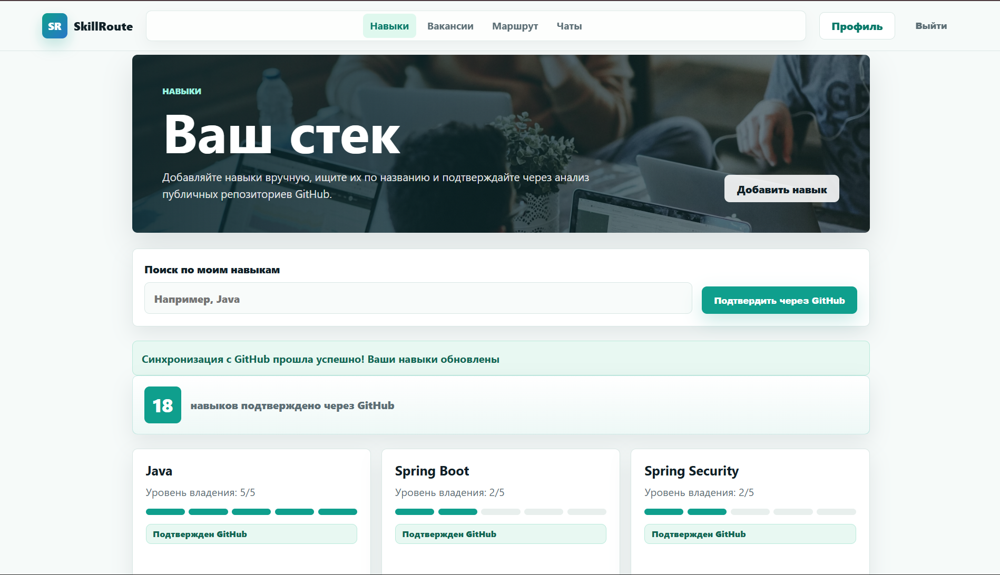

### GitHub Skill Sync Status
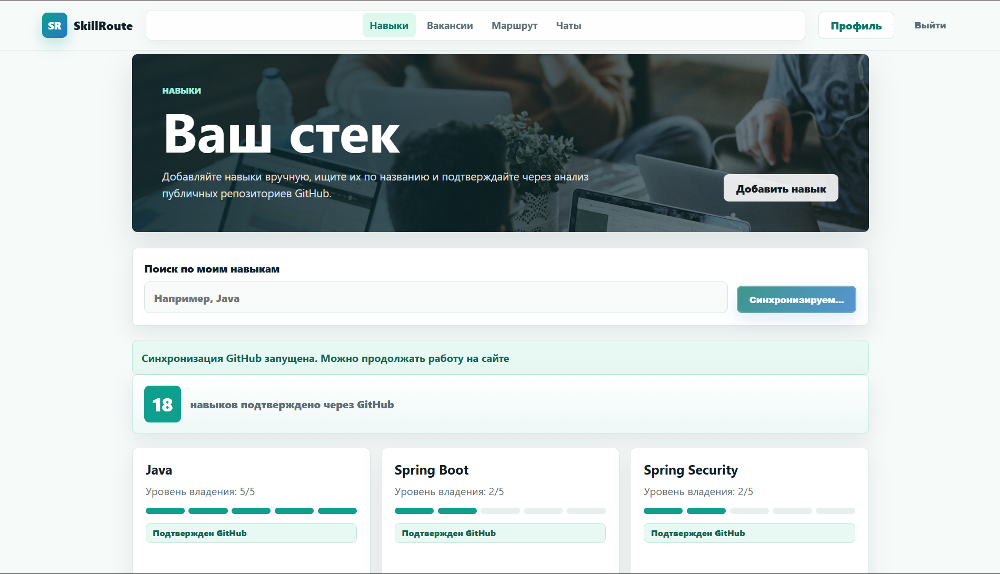

### Student Vacancy Catalog: Recommendations, Filters, and Tracked Vacancies
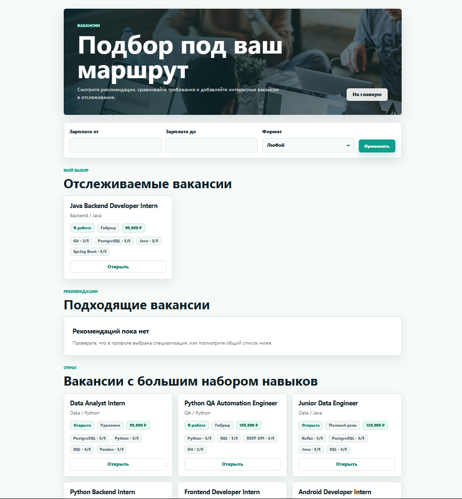

### Vacancy Roadmap with Match Percentage and Missing Skills
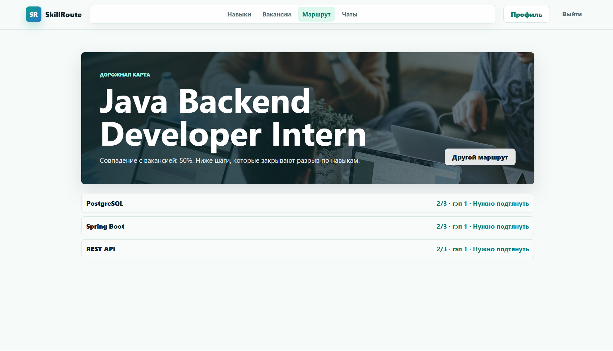

### Skill Detail Page from Roadmap with Learning Resources
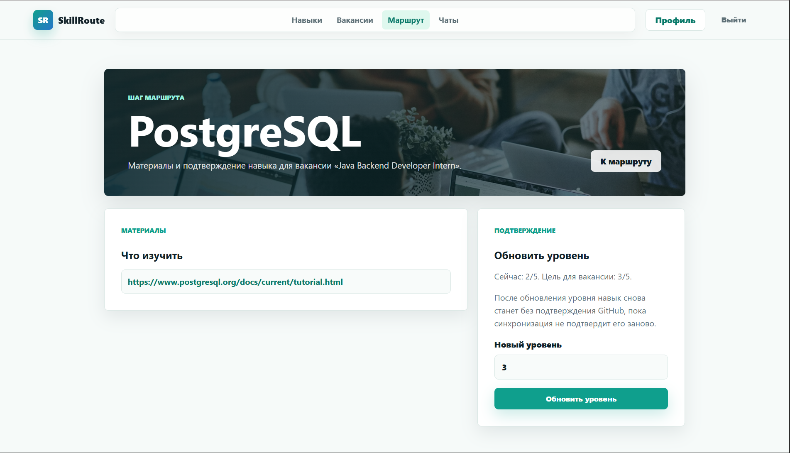

### Company Profile After Filling In Details
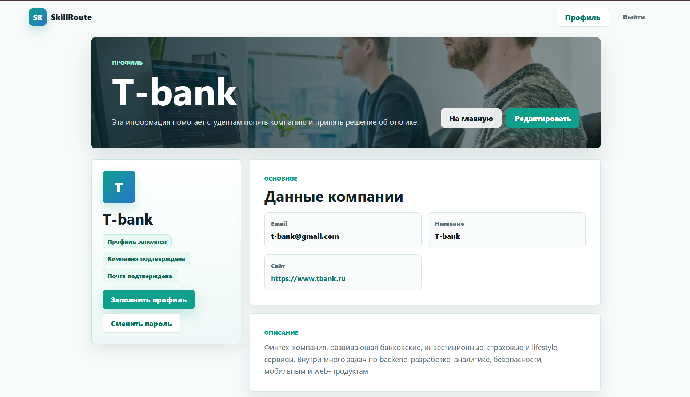

### Company Vacancy List
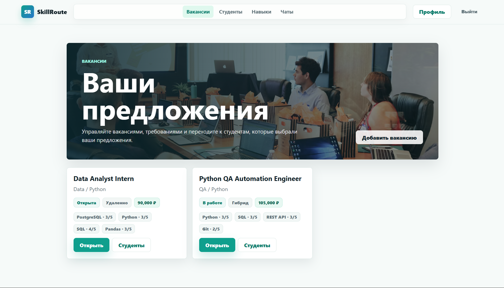

### Vacancy Creation Form with Required Skills
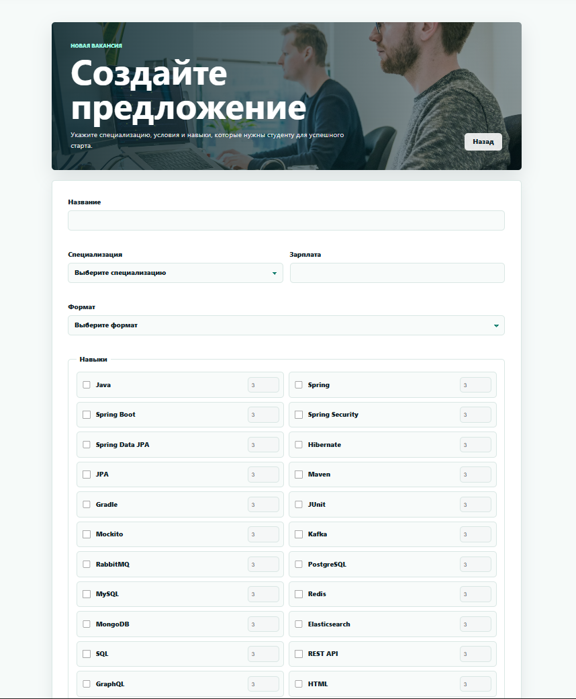

### Candidate List for a Vacancy
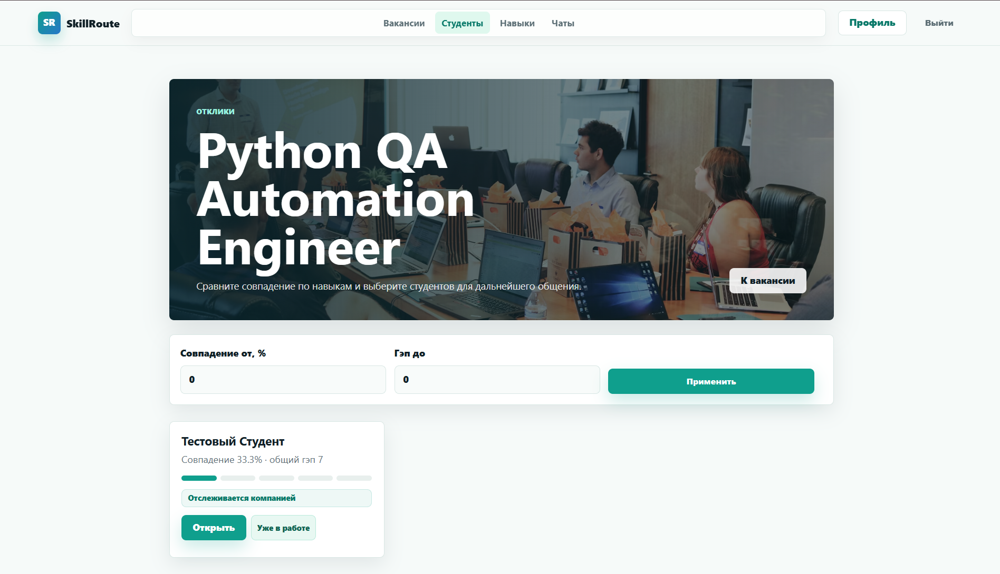

### Chat Between Company and Student
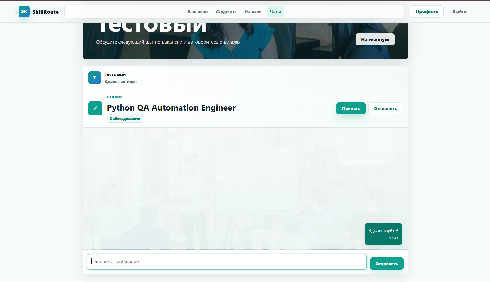

### Admin Company Approval Page
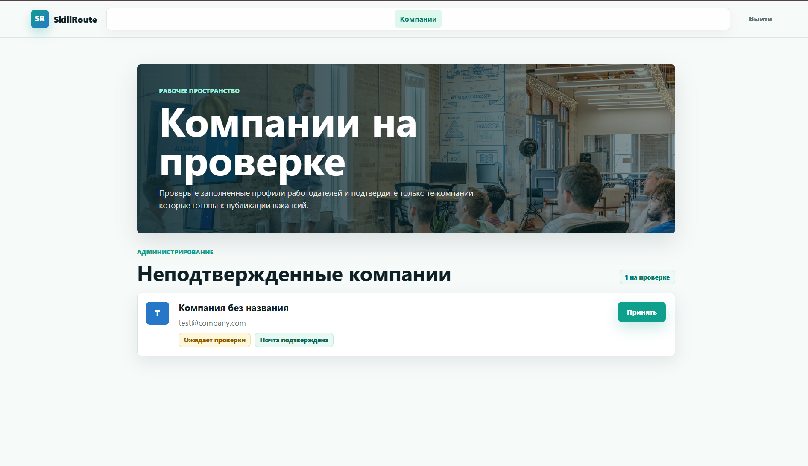

## Support & Contact

Have questions? Need help with setup? Found a bug?

Email: **mairabeeva42@gmail.com** | Telegram: @arinkmm
