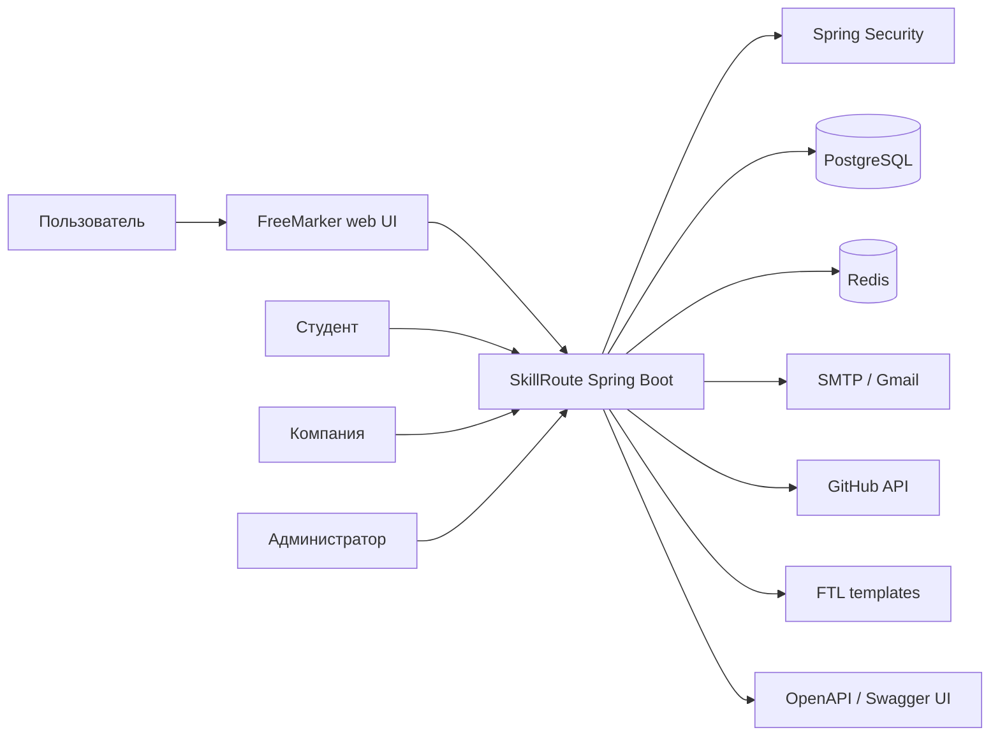

# SkillRoute

SkillRoute - это веб-платформа для студентов и компаний, которая помогает связывать навыки кандидата с требованиями вакансий. Студент собирает профиль, добавляет навыки, подтверждает их через GitHub и получает маршруты развития под выбранные вакансии. Компания публикует вакансии, смотрит подходящих студентов, ведет отклики и общается с кандидатами в чате.

Проект сделан как монолитное Spring Boot-приложение: серверная часть отвечает за веб-страницы, AJAX API, регистрацию, безопасность, бизнес-логику, работу с PostgreSQL/Redis, отправку писем и фоновую синхронизацию навыков с GitHub. Интерфейс построен на FreeMarker-шаблонах, CSS и небольших JavaScript-модулях для форм, чата и асинхронных действий.

## Возможности

- Регистрация студентов и компаний с подтверждением email.
- Вход через Spring Security, роли `STUDENT`, `COMPANY`, `ADMIN`.
- Восстановление и изменение пароля через email-токены в Redis.
- Личные кабинеты студента и компании.
- Профиль студента: имя, фамилия, специализация, GitHub, описание.
- Профиль компании: название, описание, сайт и админское подтверждение компании.
- Каталог навыков и специализаций с seed-данными при первом запуске.
- Навыки студента с уровнем владения от 1 до 5.
- Синхронизация навыков с GitHub: анализ репозиториев, языков, topics, описаний и code search.
- Фоновая очередь GitHub-синхронизации с обработкой rate limit и повторными попытками.
- Вакансии компаний со специализацией, зарплатой, графиком, статусом и требуемыми навыками.
- Каталог вакансий для студента: рекомендации, популярные вакансии, фильтрация и отслеживаемые вакансии.
- Отклики студентов на вакансии и статусы `SUBMITTED`, `REVIEWING`, `INTERVIEW`, `REJECTED`, `ACCEPTED`.
- Roadmap по вакансии: расчет совпадения, недостающие навыки, глубина разрыва и учебные материалы.
- Материалы по навыкам, которыми управляет компания.
- Чаты между компанией и студентом по вакансии.
- OpenAPI-описание AJAX API и Swagger UI.
- Docker Compose окружение с приложением, PostgreSQL и Redis.

## Архитектура



### Слои проекта

| Путь | Назначение |
| --- | --- |
| `src/main/java/com/skillroute/controller` | MVC-страницы и REST-контроллеры для AJAX API |
| `src/main/java/com/skillroute/service` | Бизнес-логика регистрации, профилей, вакансий, roadmap, чатов и GitHub-синхронизации |
| `src/main/java/com/skillroute/repository` | Spring Data JPA репозитории и кастомные запросы |
| `src/main/java/com/skillroute/model` | JPA-сущности и enum-статусы |
| `src/main/java/com/skillroute/dto` | DTO запросов и ответов для страниц и API |
| `src/main/java/com/skillroute/mapper` | Маппинг сущностей в DTO |
| `src/main/resources/templates` | FreeMarker-шаблоны страниц |
| `src/main/resources/static` | CSS, JavaScript и OpenAPI YAML |
| `src/main/resources/db` | Liquibase changelog и seed-данные |
| `http` | HTTP-запросы для ручной проверки страниц и AJAX API |

### Основные сущности

| Сущность | Назначение |
| --- | --- |
| `account` | Учетная запись, email, пароль, роль, флаг подтверждения |
| `student_profile` | Профиль студента, GitHub URL, специализация, описание |
| `company_profile` | Профиль компании и флаг админского подтверждения |
| `specialization` | Направление и язык: backend, frontend, data, devops и другие |
| `skill`, `student_skill` | Справочник навыков и навыки студента с уровнем |
| `skill_dictionary` | Правила поиска навыков в GitHub |
| `vacancy`, `vacancy_profile`, `vacancy_skill` | Вакансия, профиль вакансии и требуемые навыки |
| `student_vacancy` | Отклик или отслеживание вакансии студентом |
| `resource` | Учебные материалы по навыкам |
| `chat`, `message` | Диалоги и сообщения |
| `github_sync_job` | Очередь фоновой синхронизации GitHub |

## Стек

- Java 23
- Spring Boot 3.4.3
- Gradle Kotlin DSL
- Spring MVC + FreeMarker
- Spring Security
- Spring Data JPA
- PostgreSQL 17
- Liquibase
- Redis 7
- Spring Mail / SMTP
- OkHttp
- Springdoc OpenAPI + Swagger UI
- OpenAPI Generator 7.10.0
- Lombok
- Docker и Docker Compose
- JUnit 5, Spring Security Test, JaCoCo

## Быстрый старт

### Требования

- JDK 23
- Docker и Docker Compose
- GitHub token для анализа репозиториев
- SMTP-аккаунт для отправки писем. Для Gmail обычно нужен app password.

### Запуск через Docker Compose

1. Создайте локальный `.env` из шаблона:

```powershell
Copy-Item .env.example .env
```

Для Linux/macOS:

```bash
cp .env.example .env
```

2. Заполните `.env`:

```dotenv
DB_USER=skillroute
DB_PASSWORD=change_me
DB_NAME=skillroute_db
APP_PORT=8080

MAIL_USER=example@gmail.com
MAIL_PASSWORD=change_me
MAIL_BASE_URL=http://localhost:8080

GITHUB_TOKEN=github_pat_change_me
```

3. Соберите и запустите окружение:

```powershell
docker compose up --build -d
```

4. Проверьте контейнеры:

```powershell
docker compose ps
```

5. Откройте приложение:

```text
http://localhost:8080
```

Swagger UI:

```text
http://localhost:8080/swagger-ui.html
```

Остановка окружения:

```powershell
docker compose down
```

Остановка с удалением данных PostgreSQL и Redis:

```powershell
docker compose down -v
```

### Локальный запуск из IDE или Gradle

Для запуска приложения вне Docker нужны PostgreSQL на `localhost:5432` и Redis на `localhost:6379`. Переменные окружения можно задать в конфигурации IDE или прямо в PowerShell:

```powershell
$env:DB_USER="skillroute"
$env:DB_PASSWORD="change_me"
$env:DB_NAME="skillroute_db"
$env:MAIL_USER="example@gmail.com"
$env:MAIL_PASSWORD="change_me"
$env:MAIL_BASE_URL="http://localhost:8080"
$env:GITHUB_TOKEN="github_pat_change_me"
.\gradlew.bat bootRun
```

Для Linux/macOS используйте `export` и `./gradlew bootRun`.

При старте Liquibase применяет миграции из `src/main/resources/db/changelog`, а `DatabaseSeeder` наполняет базу специализациями, навыками и GitHub-словарем из `src/main/resources/db/data/skills-seed.sql`, если словарь еще пуст.

## Переменные окружения

| Переменная | Назначение |
| --- | --- |
| `DB_USER` | Пользователь PostgreSQL |
| `DB_PASSWORD` | Пароль PostgreSQL |
| `DB_NAME` | Имя базы данных |
| `APP_PORT` | Внешний порт приложения в Docker Compose, по умолчанию `8080` |
| `MAIL_USER` | SMTP-логин отправителя |
| `MAIL_PASSWORD` | SMTP-пароль или app password |
| `MAIL_BASE_URL` | Базовый URL для ссылок подтверждения email и сброса пароля |
| `GITHUB_TOKEN` | Token для GitHub REST API и code search |
| `SPRING_DATASOURCE_URL` | Опциональный override JDBC URL |
| `SPRING_DATA_REDIS_HOST` | Опциональный override Redis host |

## Порты

| Компонент | URL |
| --- | --- |
| SkillRoute | <http://localhost:8080> |
| Login | <http://localhost:8080/login> |
| Swagger UI | <http://localhost:8080/swagger-ui.html> |
| OpenAPI YAML | <http://localhost:8080/openapi/skillroute-api.yaml> |

В Docker Compose PostgreSQL и Redis доступны внутри сети `skillroute_net`. Наружу публикуется только приложение.

## Пользовательские сценарии

### Студент

1. Регистрируется на `/register` с ролью `STUDENT`.
2. Подтверждает email по ссылке из письма.
3. Заполняет профиль на `/student/profile/update`.
4. Добавляет навыки на `/student/skills`.
5. Указывает GitHub URL и запускает синхронизацию навыков.
6. Смотрит вакансии на `/student/vacancies`, фильтрует каталог и откликается.
7. Открывает `/route`, выбирает отслеживаемую вакансию и получает roadmap по недостающим навыкам.
8. Ведет переписку с компанией в `/student/chats`.

### Компания

1. Регистрируется на `/register` с ролью `COMPANY`.
2. Подтверждает email и заполняет профиль на `/company/profile/update`.
3. Ждет подтверждения от администратора.
4. Создает вакансии на `/company/vacancies/create`.
5. Просматривает кандидатов на `/company/vacancies/{id}/applicants`.
6. Берет студента в работу, начинает чат и меняет статус отклика.
7. Добавляет учебные материалы к навыкам через раздел `/company/skills`.

### Администратор

Администратор видит компании, ожидающие подтверждения, на `/main` и подтверждает их через `POST /main/companies/{id}/approve`. Регистрация через форму доступна только для студентов и компаний, поэтому админскую учетную запись нужно создавать отдельно, если нужна модерация компаний.

## API и контракты

OpenAPI-спецификация находится в `src/main/resources/static/openapi/skillroute-api.yaml`. Swagger UI доступен по адресу `/swagger-ui.html`.

### AJAX API

| Метод | Endpoint | Описание |
| --- | --- | --- |
| `POST` | `/register/check-field` | Проверка формы регистрации |
| `POST` | `/password/reset/check-field` | Проверка формы нового пароля |
| `POST` | `/account/password/check-field` | Проверка смены пароля текущего пользователя |
| `GET` | `/student/skills/search?name=java` | Поиск навыков студента |
| `POST` | `/student/skills/github-sync` | Поставить GitHub-синхронизацию в очередь |
| `GET` | `/student/skills/github-sync/status` | Получить статус GitHub-синхронизации |
| `GET` | `/chat/{id}/messages` | Получить сообщения чата |
| `POST` | `/chat/{id}/send` | Отправить сообщение в чат |

### Web-страницы

| Раздел | Основные маршруты |
| --- | --- |
| Публичные страницы | `/`, `/register`, `/login`, `/verification`, `/password/forgot`, `/password/reset` |
| Кабинет | `/main` |
| Студент | `/student/profile`, `/student/skills`, `/student/vacancies`, `/route`, `/student/chats` |
| Компания | `/company/profile`, `/company/vacancies`, `/company/students`, `/company/skills`, `/company/chats` |
| Чат | `/chat/{id}/messages`, `/chat/{id}/send` |
| Документация API | `/swagger-ui.html`, `/openapi/skillroute-api.yaml` |

Для ручной проверки есть готовые HTTP-запросы:

- `http/web-pages.http`
- `http/ajax-api.http`

## GitHub-синхронизация навыков

Синхронизация запускается студентом из раздела навыков. Приложение извлекает username из GitHub URL, собирает сигналы из репозиториев через `https://api.github.com/users/{username}/repos`, а затем при необходимости делает code search по правилам из `skill_dictionary`.

Очередь хранится в таблице `github_sync_job`. Worker запускается по расписанию `github.sync.worker-delay-millis`, переводит задачи в `RUNNING`, обновляет прогресс и завершает их статусом `SUCCESS` или `FAILED`. Если GitHub возвращает rate limit, задача возвращается в `PENDING` с `retry_after_at`.

## Тесты и качество

Запуск тестов:

```powershell
.\gradlew.bat test
```

Проверка покрытия JaCoCo:

```powershell
.\gradlew.bat jacocoTestCoverageVerification
```

Генерация OpenAPI моделей:

```powershell
.\gradlew.bat openApiGenerate
```

Сборка jar:

```powershell
.\gradlew.bat bootJar
```

Для Linux/macOS замените `.\gradlew.bat` на `./gradlew`.

## Структура базы данных

Миграции подключены через `src/main/resources/db/master.xml`:

- `2026-04-21--01-create-profiles-tables.sql` - аккаунты, профили, специализации.
- `2026-04-22--02-create-skill-tables.sql` - навыки студентов.
- `2026-04-24--03-create-vacancies-tables.sql` - вакансии, требования и отклики.
- `2026-04-25--04-create-resource-table.sql` - учебные материалы.
- `2026-05-03--05-create-chats-tables.sql` - чаты и сообщения.
- `2026-05-07--06-create-skill-dictionary.sql` - словарь сигналов для GitHub.
- `2026-05-18--07-create-github-sync-job.sql` - очередь GitHub-синхронизации.

## Скриншоты

### Главная страница


### Форма регистрации с выбором роли студента или компании


### Заполненный профиль студента


### Раздел навыков студента


### Состояние синхронизации навыков с GitHub


### Каталог вакансий студента: рекомендации, фильтры и отслеживаемые вакансии


### Roadmap по вакансии с процентом совпадения и недостающими навыками


### Детальная страница навыка из roadmap с учебными материалами


### Профиль компании после заполнения данных


### Список вакансий компании


### Форма создания вакансии с требуемыми навыками


### Список кандидатов по вакансии


### Чат между компанией и студентом


### Админская страница подтверждения компаний


## Поддержка и контакты
Остались вопросы? Нужна помощь с настройкой? Нашли баг?

Email: **mairabeeva42@gmail.com** | Telegram: @arinkmm
